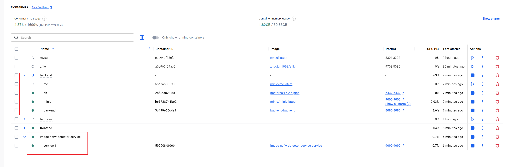
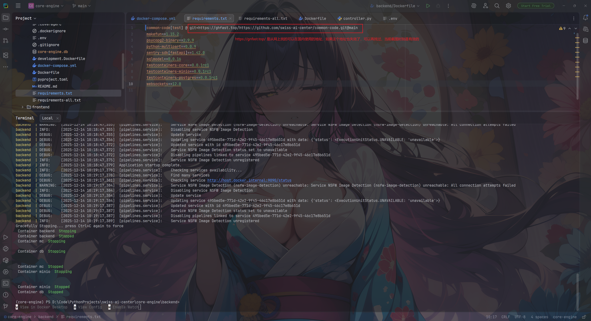

# ImgAT
ImageAnalyzeTool（图片分析工具）
# 工作流设计
- 读取图片，获取长宽等信息，写入数据库（批量写）
- 上传图片到OBS（单个图片）
- 调用image-nsfw-detector-service服务（单个图片）
- 更新结果（单个图片）
- 删除上传到OBS的图片和结果文件（单个图片）
# 注意事项
1. Temporal的Worker需要独立启动，启动命令为：
    ```shell
    python src/temporal/worker.py
    ```
2. temporal服务使用docker构建，跑本服务之前需要先将temporal服务起起来
    
    如上图
3. 识别图片是否是NSFW内容使用的是image-nsfw-detector-service服务
   1. 该服务需要启动两个docker容器，如图
   2. 如果backend服务因为无法下载GitHub代码仓而启动失败，可以考虑编辑D:\Code\PythonProjects\swiss-ai-center\core-engine\backend\requirements.txt这个文件，
   换成可以使用的国内GitHub地址，如图
   3. 如果按照第二点改为后，进入到D:\Code\PythonProjects\swiss-ai-center\core-engine\backend路径下，
   执行docker compose build，重新构建下backend的镜像，然后再尝试启动
4. image-nsfw-detector-service服务运行期间不能开启VPN，不然docker里面的服务会找不到host.docker.internal这个特殊的域名
5. 